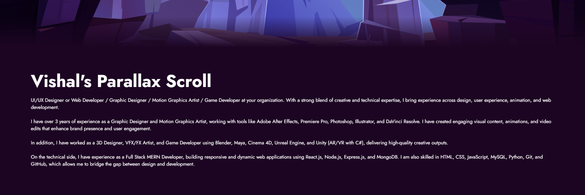

## 📸 Screenshots

### Hero Section

### About Section

# 🌙 Vishal's Parallax Scroll Website

A modern parallax scrolling portfolio website built using HTML, CSS, and JavaScript. The project features layered parallax effects, smooth scrolling animations, and a responsive design to create an immersive user experience.

Designed with a clean and visually engaging interface, the website showcases creative design principles while maintaining performance and responsiveness across devices.

## ✨ Features

- Multi-Layer Parallax Scrolling
- Responsive Design
- Smooth Scroll Effects
- Modern UI/UX
- Interactive Navigation
- Animated Hero Section
- Clean & Minimal Layout
- Cross-Browser Compatibility

## 🛠 Tech Stack

- HTML5
- CSS3
- JavaScript